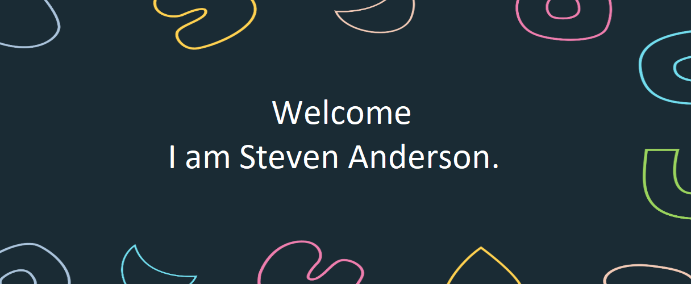

Hey there 👋

I’m Steven, a Senior Full Stack and Blockchain Developer with over 7+ years of experience in designing, developing, and
implementing web Mobile and Blockchain applications. Proficient in full stack and blockchain technologies,
databases, and web servers. Seeking a challenging position in a dynamic organization to utilize my skills
and experience to contribute to the growth and success of the company..

## 🔥 GitHub Stats

 

 
 

## 🛠️ Skills

More Skills

 

 

 

 

## 📕 Latest Blog Posts

